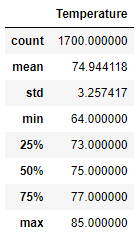
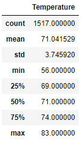

# surfs_up

# Overview of the statistical analysis:
- The purpose of our analysis is to assist W.Avy with analyzing the tempartures for June and December to see if it is sustainable to run a surf and ice cream shop year round. By performing a query on the temperature data set provided to us we are able to get a summary statistic for both months. 

# Results
- Shown below are the results for both queries we ran on the months June and December. As you can see below the temperature does not change much between both months. Showing that opening a surf shop here will be a great option as the average temperature in the summer and winter a similar. 

- June has a average temperature of 74 degrees with a low of 64 and a high of 85. 

- December has a average temperature of 71 degrees with a low of 56 and a high of 83. As expected during winter time the temperature does fall pretty low but with an average of 71 you can expect great weather here year round. 

# Summary
- From the queries we ran for both months we are able to get a idea of the temperature in the are but another query that would be beneficial would be for precipitation. Knowing the precipitation would be beneficial to know because the last shop W.Avy opened was not succesful due to people unable to visit because of rain. 